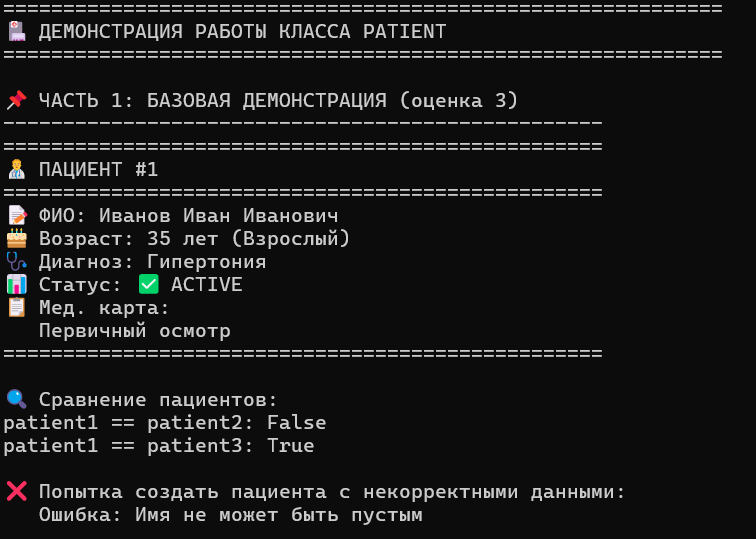
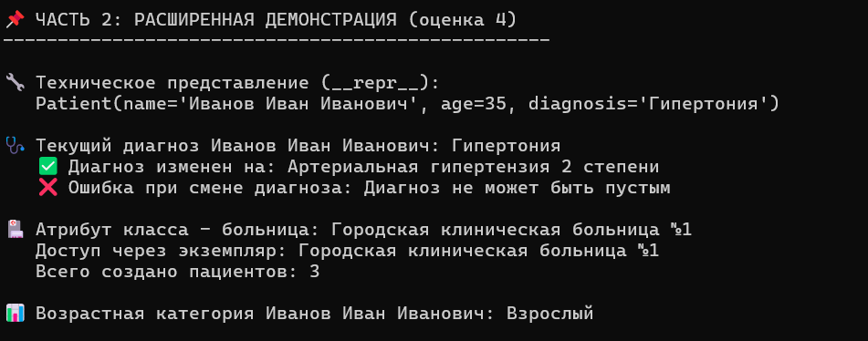
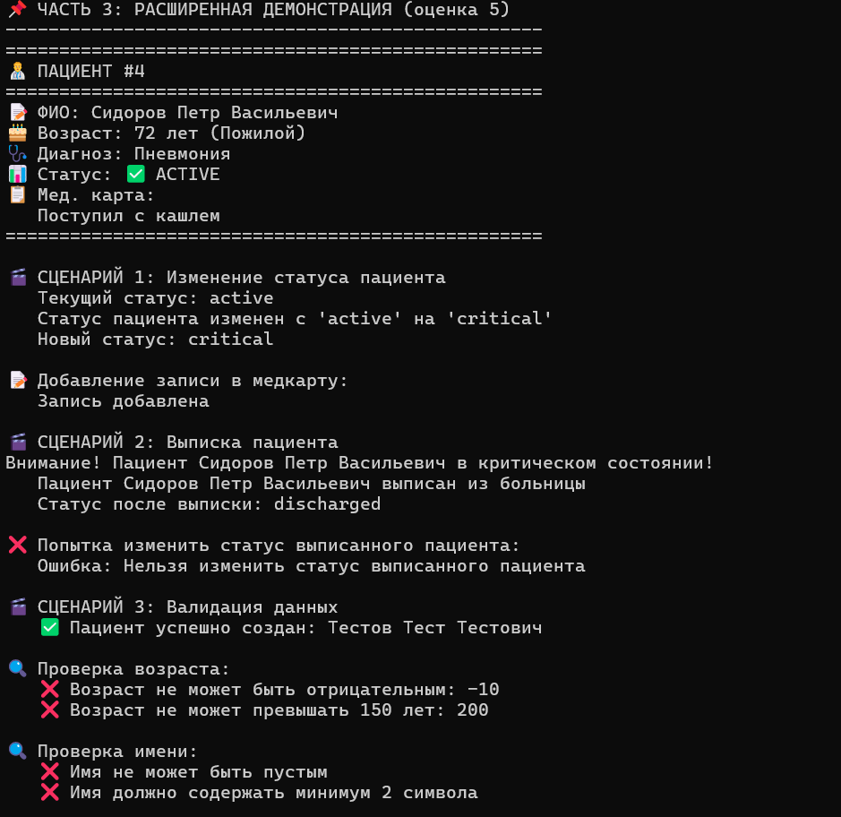

# Лабораторная работа №1 — Класс и инкапсуляция (Python)

## Выполнил: Каримов Илья Дмитриевич
## Группа: БИВТ-25-7

---

## Выбранная предметная область: **Медицина**

---

## Реализованный класс: **Patient**

### Краткое описание процесса

Класс был выбран из предметной области медицины как базовая и наиболее понятная сущность — пациент (Patient). При разработке ориентировался на реальные характеристики пациента: ФИО, возраст, диагноз, медицинская карта и статус лечения. Сразу заложил инкапсуляцию через закрытые поля и добавил валидацию, чтобы объект нельзя было создать или изменить в некорректном состоянии. Логику проверок вынес отдельно в модуль `validate.py` для удобства и переиспользования. Далее добавил бизнес-методы, отражающие реальные действия (добавление записи в медкарту, выписка, изменение статуса), и ввёл логические состояния пациента (active, critical, recovering, discharged), чтобы показать зависимость поведения от состояния. В конце реализовал магические методы для удобной работы с объектом.

---

### Краткое описание класса

**Patient** — это класс, представляющий пациента в медицинской информационной системе.

#### Поля (атрибуты)

| Поле | Тип | Доступ | Описание |
|------|-----|--------|----------|
| `_name` | str | private | ФИО пациента |
| `_age` | int | private | Возраст пациента (0-150) |
| `_diagnosis` | str | private | Диагноз |
| `_medical_record` | str | private | Медицинская карта |
| `_status` | str | private | Статус лечения |
| `_patient_id` | int | private | Уникальный ID |

#### Атрибуты класса

| Атрибут | Описание |
|---------|----------|
| `total_patients` | Общее количество созданных пациентов |
| `hospital_name` | Название больницы |

#### Логические состояния

| Статус | Значение |
|--------|----------|
| `active` | Активный (на лечении) |
| `critical` | Критическое состояние |
| `recovering` | Идёт на поправку |
| `discharged` | Выписан |

---

### Методы класса

#### Бизнес-методы

| Метод | Описание |
|-------|----------|
| `add_medical_record(entry)` | Добавляет запись в медкарту |
| `discharge()` | Выписывает пациента |
| `update_status(new_status)` | Изменяет статус |
| `get_age_category()` | Определяет возрастную категорию |

#### Свойства (property)

| Свойство | getter | setter | Описание |
|----------|--------|--------|----------|
| `name` | ✅ | ❌ | ФИО (только чтение) |
| `age` | ✅ | ❌ | Возраст (только чтение) |
| `diagnosis` | ✅ | ✅ | Диагноз с валидацией |
| `medical_record` | ✅ | ✅ | Медкарта с валидацией |
| `status` | ✅ | ❌ | Статус (только чтение) |
| `patient_id` | ✅ | ❌ | ID (только чтение) |

#### Магические методы

| Метод | Описание |
|-------|----------|
| `__str__` | Строковое представление для пользователя |
| `__repr__` | Техническое представление |
| `__eq__` | Сравнение пациентов |

---

### Ответы на вопросы с практического занятия №1

**1. В чем разница между атрибутом класса и атрибутом экземпляра?**

Атрибут класса принадлежит самому классу и общий для всех экземпляров. Атрибут экземпляра принадлежит конкретному объекту и у каждого объекта свое значение.

**2. Зачем нужен @property и чем он лучше прямого доступа?**

@property позволяет добавить валидацию, сделать атрибут только для чтения, изменить внутреннюю реализацию без изменения интерфейса.

**3. В чем разница между `__str__` и `__repr__`?**

`__str__` — для пользователей (читаемое представление), `__repr__` — для разработчиков (однозначное представление).

**4. Почему валидацию стоит выносить в отдельные методы?**

Для повторного использования кода, упрощения тестирования и соблюдения принципа DRY.

**5. Как логические состояния объекта влияют на его поведение?**

Позволяют ограничивать операции (нельзя изменить выписанного пациента) и автоматически выполнять действия при смене состояния.

---

### Демонстрация работы (demo.py)

#### Сценарий 1 — Базовая работа с объектом
- Создание объекта Patient
- Вывод через `print` (используется `__str__`)
- Сравнение объектов через `__eq__`
- Обработка ошибок через `try/except`

#### Сценарий 2 — Валидация данных
- Проверка типов и диапазонов
- Проверка на пустые строки

#### Сценарий 3 — Изменение свойств через setter
- Изменение диагноза с валидацией

#### Сценарий 4 — Бизнес-логика (добавление записей)
- Добавление записи в медицинскую карту

#### Сценарий 5 — Логическое состояние
- Изменение статуса (active → critical)
- Автоматическая запись в медкарту
- Выписка пациента
- Ошибка при изменении выписанного

---

### Скриншоты работы demo.py

#### Скриншот 1 — Базовая демонстрация (оценка 3)

#### Скриншот 2 — Расширенная демонстрация (оценка 4)

#### Скриншот 3 — Логические состояния (оценка 5)

---

