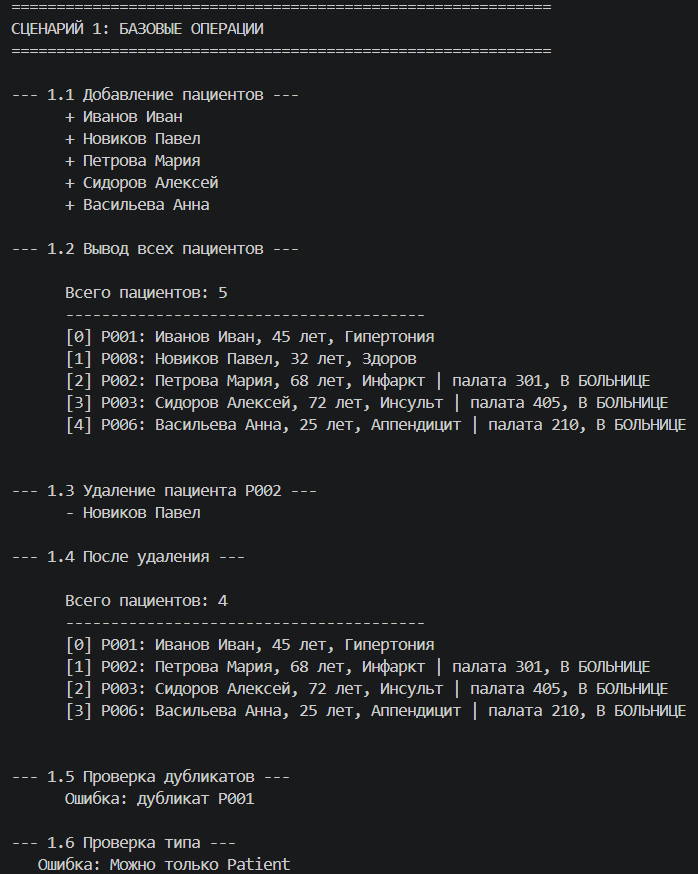
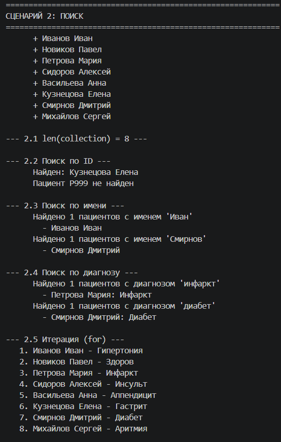
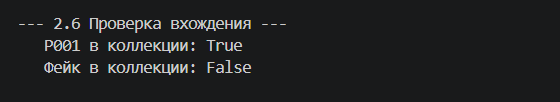
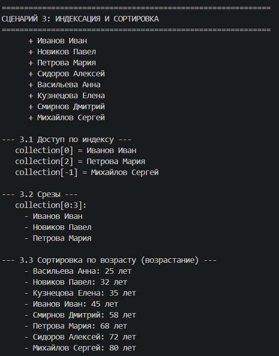
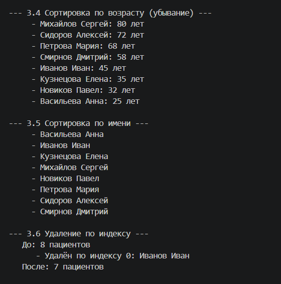
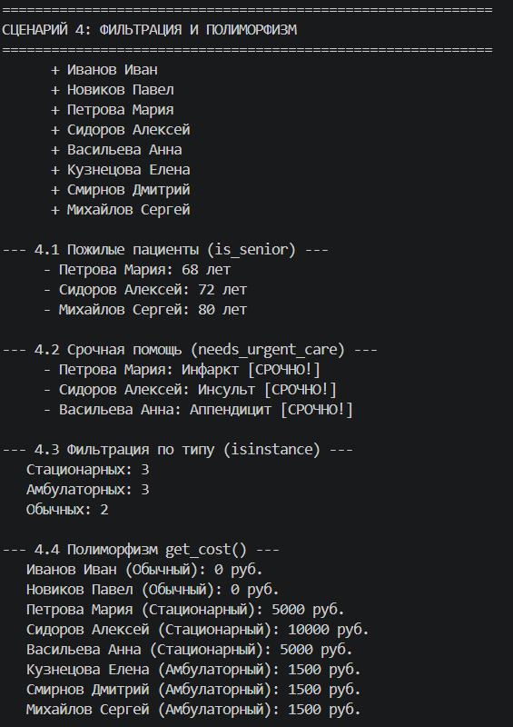
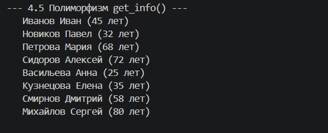
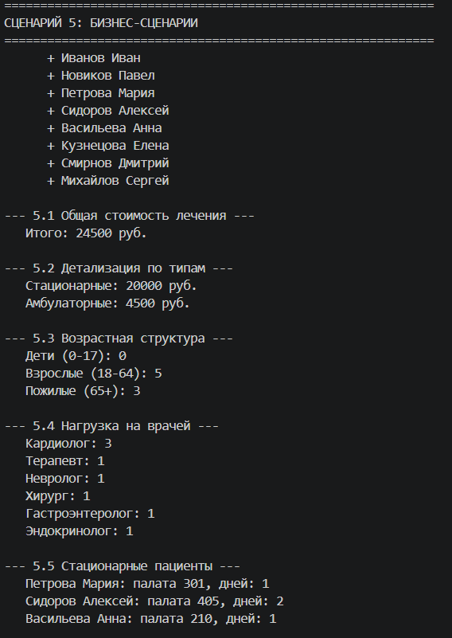
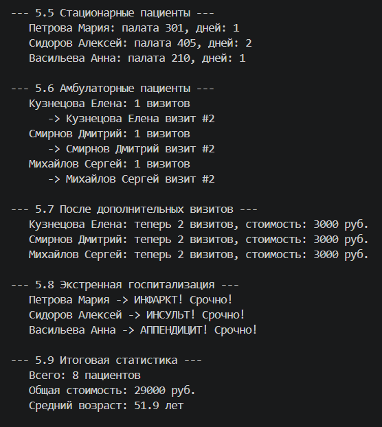
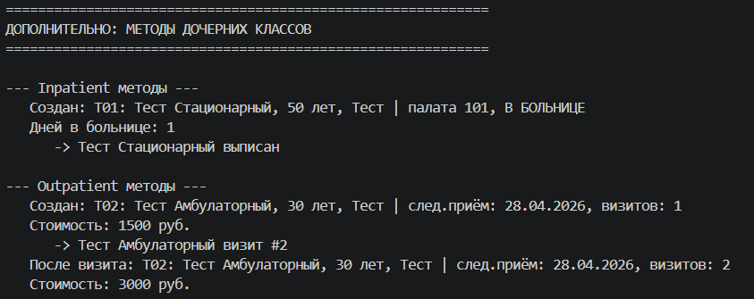

# Лабораторная работа №3
## Наследование и иерархия классов (Python)

### Выбранная предметная область
**Медицина**

---

### Реализованный класс коллекции: PatientCollection

Коллекция для хранения и управления объектами `Patient` из ЛР-1. Реализует контейнер для группы пациентов с возможностью добавления, удаления, поиска, сортировки и фильтрации. В ЛР-3 коллекция расширена для работы с иерархией классов.

---

### Реализованная иерархия классов
### Patient (Базовый класс)
### ├── Inpatient (Стационарный пациент)
### └── Outpatient (Амбулаторный пациент)

---

### Описание реализованной иерархии классов

**Базовый класс: Patient**

Атрибуты:
| Атрибут | Тип | Описание |
|---------|-----|----------|
| patient_id | str | Уникальный идентификатор пациента |
| name | str | Полное имя пациента |
| age | int | Возраст пациента |
| diagnosis | str | Диагноз |
| doctor | str | Специализация лечащего врача |
| last_visit | datetime | Дата последнего визита |

Методы:
| Метод | Описание |
|-------|----------|
| is_senior() | Проверка, пожилой ли пациент (старше 65 лет) |
| needs_urgent_care() | Проверка необходимости срочной помощи |
| get_cost() | Расчет стоимости лечения (базовый) |
| get_type() | Получение типа пациента |
| get_info() | Получение краткой информации |

**Дочерний класс: Inpatient (Стационарный пациент)**

Новые атрибуты:
| Атрибут | Тип | Описание |
|---------|-----|----------|
| ward | str | Номер палаты |
| admission | datetime | Дата поступления |
| discharged | bool | Статус выписки |

Новые методы:
| Метод | Описание |
|-------|----------|
| discharge() | Выписать пациента |
| get_days() | Количество дней в стационаре |

Переопределенные методы:
| Метод | Новая реализация |
|-------|------------------|
| get_cost() | 5000 руб. × количество дней |
| get_type() | "Стационарный пациент" |

**Дочерний класс: Outpatient (Амбулаторный пациент)**

Новые атрибуты:
| Атрибут | Тип | Описание |
|---------|-----|----------|
| next_date | datetime | Дата следующего приема |
| visits | int | Количество посещений |

Новые методы:
| Метод | Описание |
|-------|----------|
| add_visit() | Зарегистрировать новый визит |

Переопределенные методы:
| Метод | Новая реализация |
|-------|------------------|
| get_cost() | 1500 руб. × количество визитов |
| get_type() | "Амбулаторный пациент" |

---

### Методы коллекции PatientCollection

| Категория | Методы |
|-----------|--------|
| Базовые операции | add(), remove(), remove_at(), get_all() |
| Поиск | find_by_id(), find_by_name(), find_by_diagnosis() |
| Магические методы | __len__(), __iter__(), __getitem__(), __contains__() |
| Сортировка | sort_by_age(), sort_by_name() |
| Фильтрация | get_seniors(), get_urgent(), get_inpatients(), get_outpatients() |

---

### Демонстрация работы (demo.py)

#### Сценарий 1 — Базовые операции

**Что демонстрируется:** создание коллекции, добавление пациентов разных типов, вывод всех пациентов, удаление пациента, проверка типа, защита от дубликатов.

---

#### Сценарий 2 — Поиск и магические методы

**Что демонстрируется:** поиск по ID, поиск по имени, поиск по диагнозу, len(), итерация for, проверка in.

---

#### Сценарий 3 — Индексация и сортировка

**Что демонстрируется:** доступ по индексу (положительные и отрицательные), срезы, сортировка по возрасту (возрастание/убывание), сортировка по имени, удаление по индексу.

---

#### Сценарий 4 — Фильтрация и полиморфизм

**Что демонстрируется:** фильтрация пожилых пациентов, фильтрация срочной помощи, фильтрация по типу (Inpatient/Outpatient), полиморфизм get_cost(), полиморфизм get_info(), проверка isinstance().

---

#### Сценарий 5 — Бизнес-сценарии

**Что демонстрируется:** общая стоимость лечения, возрастная структура (дети/взрослые/пожилые), нагрузка на врачей, работа со стационарными пациентами, работа с амбулаторными пациентами, экстренная госпитализация.

### Дополнительно — Методы дочерних классов

**Что демонстрируется:** работа специфических методов классов `Inpatient` и `Outpatient`, которые отсутствуют в базовом классе `Patient`.

**Inpatient методы:**
- `get_days()` — расчет количества дней в стационаре
- `discharge()` — выписка пациента из больницы

**Outpatient методы:**
- `add_visit()` — регистрация нового визита (увеличивает счетчик `visits`)
- `get_cost()` — переопределенный метод, стоимость зависит от количества визитов

**Результат:**

