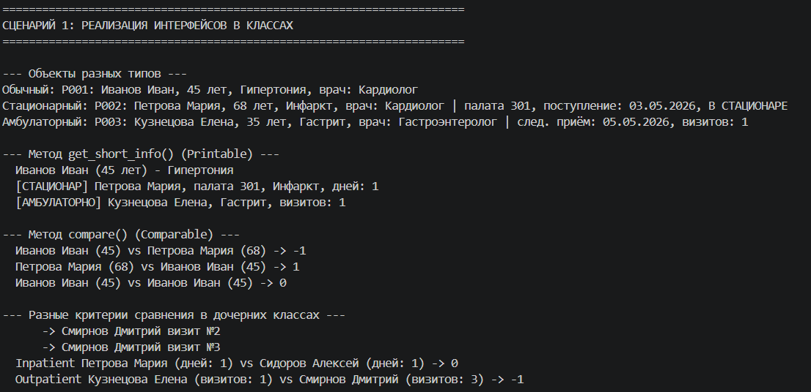
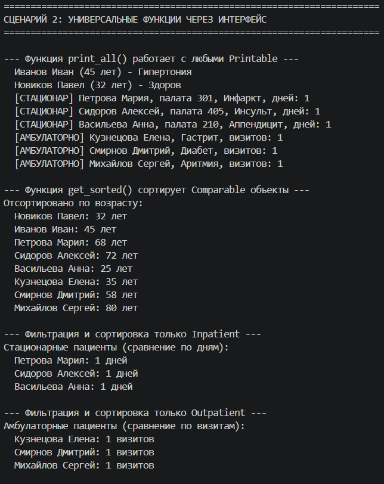
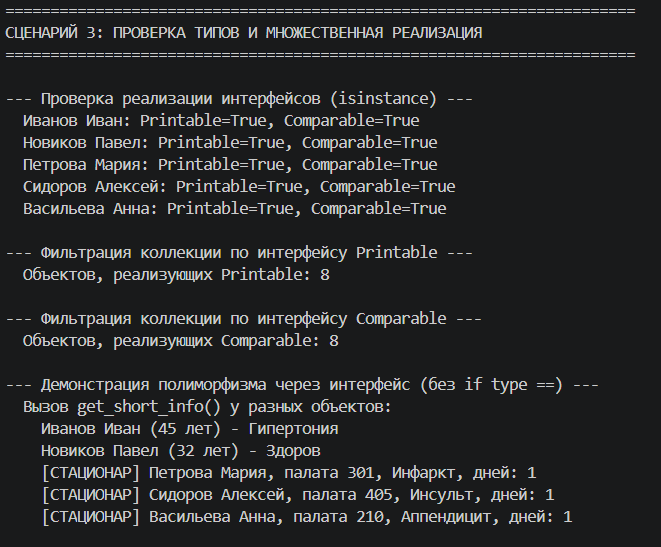
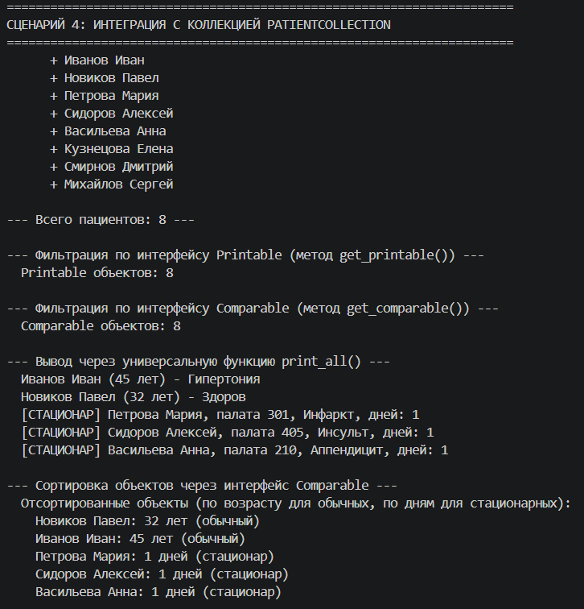
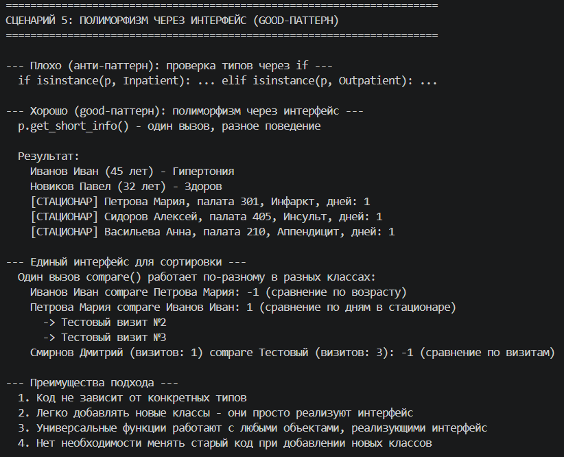

# Лабораторная работа №4
## Интерфейсы и абстрактные классы (Python)

### Выбранная предметная область
**Медицина**

---

### Реализованная система интерфейсов на основе существующих классов

| Интерфейс | Назначение | Абстрактные методы |
|-----------|------------|---------------------|
| `Printable` | Предоставление строкового представления объекта | `get_short_info()` |
| `Comparable` | Сравнение объектов между собой | `compare(other)` |
| `Billable` | Расчет стоимости лечения | `get_cost()`, `get_details()` |
| `Dischargeable` | Управление выпиской пациента | `can_be_discharged()`, `discharge()` |

---

### Описание реализованных интерфейсов

#### Интерфейс `Printable`

Контракт для объектов, которые могут предоставить строковое представление.

**Реализация в классах (`get_short_info()`):**

| Класс | Реализация |
|-------|------------|
| `Patient` | `"{name} ({age} лет) - {diagnosis}"` |
| `Inpatient` | `"[СТАЦИОНАР] {name}, палата {ward}, {diagnosis}, дней: {days}"` |
| `Outpatient` | `"[АМБУЛАТОРНО] {name}, {diagnosis}, визитов: {visits}"` |

---

#### Интерфейс `Comparable`

Контракт для объектов, поддерживающих сравнение.

**Реализация в классах (`compare(other)`):**

| Класс | Критерий сравнения | Пример |
|-------|---------------------|--------|
| `Patient` | Возраст | 45 лет < 68 лет → -1 |
| `Inpatient` | Количество дней в стационаре | 1 день < 5 дней → -1 |
| `Outpatient` | Количество визитов | 1 визит < 3 визита → -1 |

---

#### Интерфейс `Billable`

Контракт для объектов, у которых можно рассчитать стоимость лечения.

**Реализация в классах:**

| Класс | `get_cost()` | `get_details()` |
|-------|--------------|-----------------|
| `Patient` | 0 руб. | "Базовое обследование" |
| `Inpatient` | 5000 руб. × дни | "Стационарное лечение + питание" |
| `Outpatient` | 1500 руб. × визиты | "Амбулаторный прием + консультация" |

---

#### Интерфейс `Dischargeable`

Контракт для управления выпиской пациента.

**Реализация в классах:**

| Класс | `can_be_discharged()` | `discharge()` |
|-------|----------------------|---------------|
| `Patient` | Всегда True | Ничего не делает |
| `Inpatient` | True если не критическое состояние | Выписывает из стационара |
| `Outpatient` | Всегда True | Закрывает амбулаторную карту |

**Особенности:**
- Стационарный пациент не может быть выписан при срочном состоянии (инфаркт, инсульт)
- Амбулаторный пациент требует проверки всех визитов перед выпиской

---

### Расширение коллекции `PatientCollection`

| Метод | Описание |
|-------|----------|
| `get_printable_items()` | Возвращает все объекты, реализующие `Printable` |
| `get_comparable_items()` | Возвращает все объекты, реализующие `Comparable` |
| `get_billable_items()` | Возвращает все объекты, реализующие `Billable` |
| `print_all()` | Массовая печать через интерфейс `Printable` |
| `sort_by_comparable()` | Сортировка через интерфейс `Comparable` |
| `filter_by_interface(interface)` | Универсальная фильтрация по интерфейсу |

---

### Демонстрация работы (demo.py)

#### Сценарий 1 — Интерфейс как тип (полиморфизм)

**Что демонстрируется:**
- Функция `print_all_printable(items: list[Printable])` принимает любые объекты, реализующие `Printable`
- Отсутствие привязки к конкретным типам пациентов
- Единый интерфейс для разных классов

---

#### Сценарий 2 — Проверка через `isinstance()`

**Что демонстрируется:**
- Проверка реализации интерфейсов у объектов разных типов
- Множественная реализация интерфейсов (один объект может реализовывать несколько интерфейсов)
- Вызов методов через интерфейс

---

#### Сценарий 3 — Интеграция с коллекцией

**Что демонстрируется:**
- Фильтрация коллекции по интерфейсу
- Сортировка через `Comparable` (разные критерии для разных типов)
- Массовая печать через единый интерфейс

---

#### Сценарий 4 — Полиморфизм без `isinstance` (Good-паттерн)

**Что демонстрируется:**
- Сравнение "плохого" подхода (проверка конкретных типов) и "хорошего" (работа через интерфейс)
- Преимущество интерфейсного подхода: код не требует изменений при добавлении новых классов
- Единая функция `calculate_and_print()` работает с любыми `Billable`

---

#### Сценарий 5 — Множественная реализация интерфейсов

**Что демонстрируется:**
- Один класс может реализовывать все 4 интерфейса одновременно
- Демонстрация работы каждого интерфейса на одном объекте
- Разное поведение методов из одного интерфейса в разных классах

