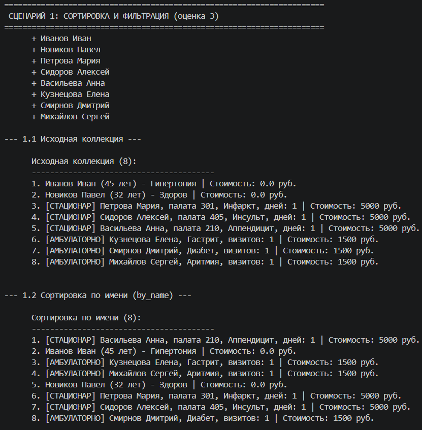
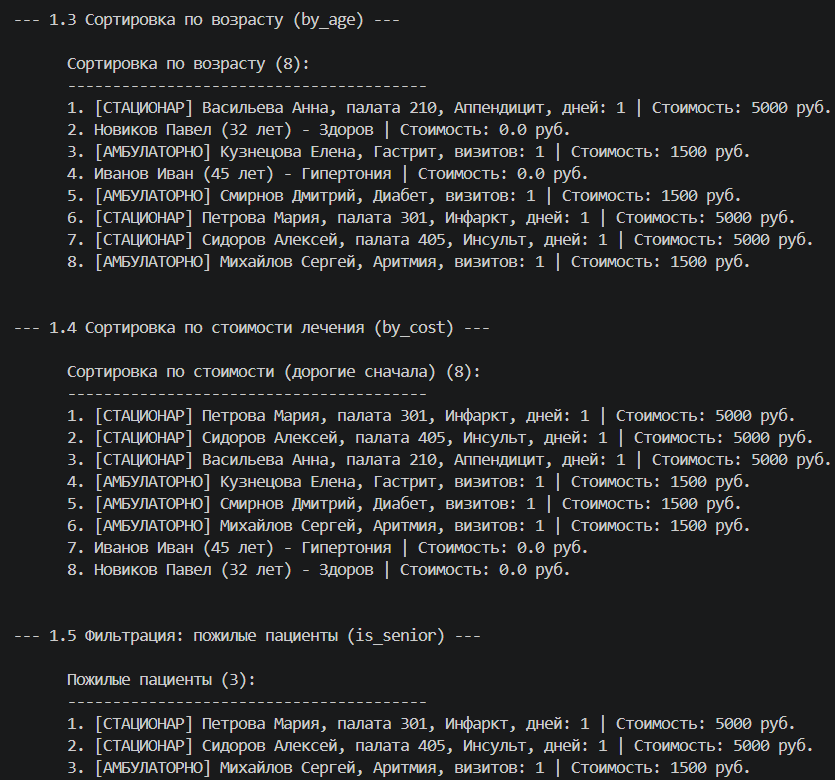
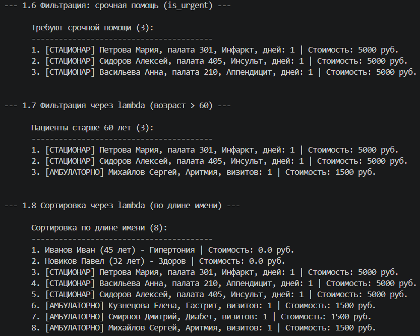
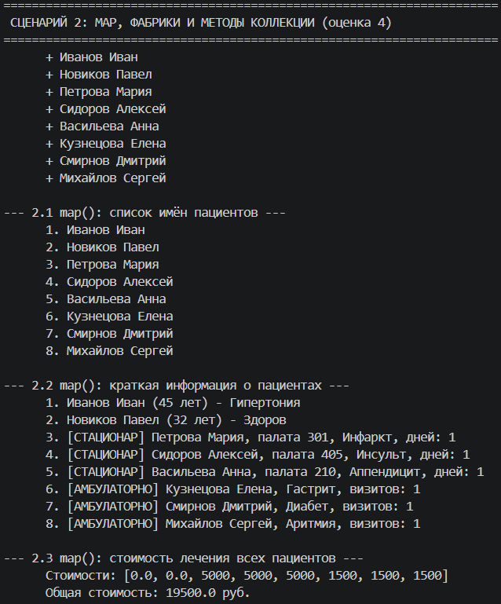
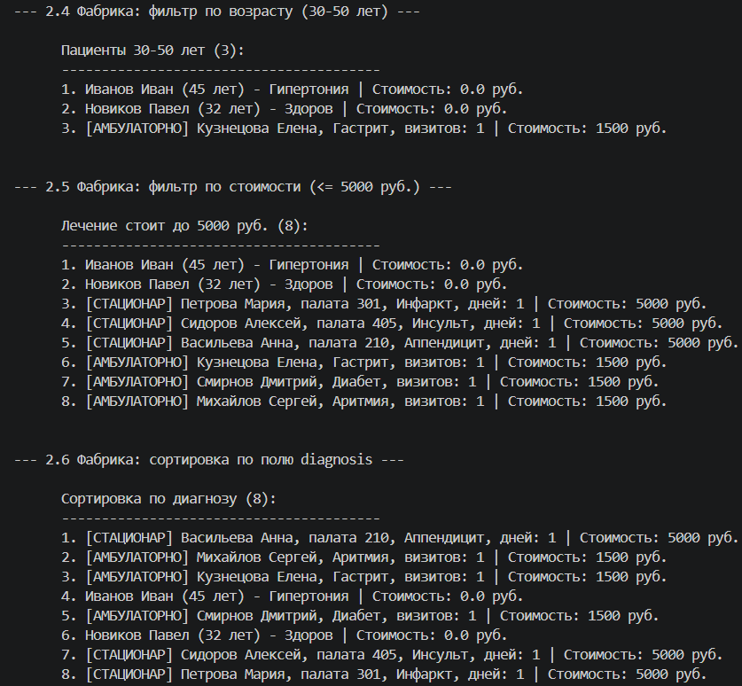
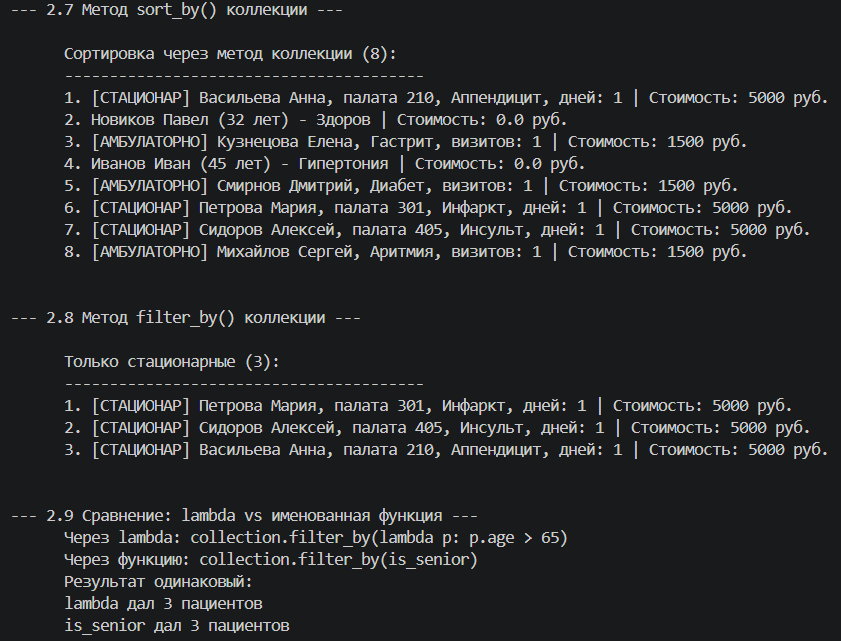
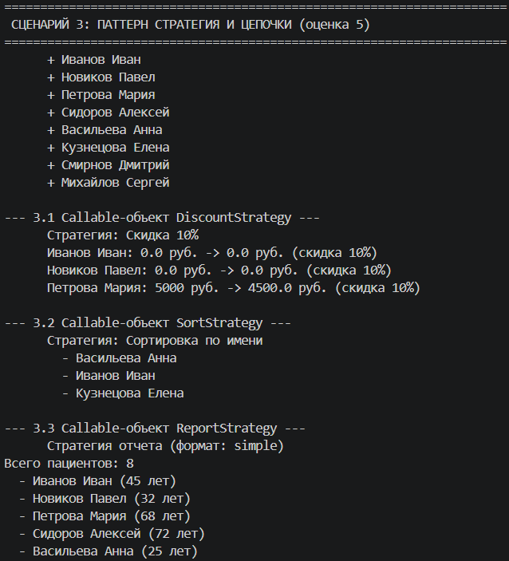
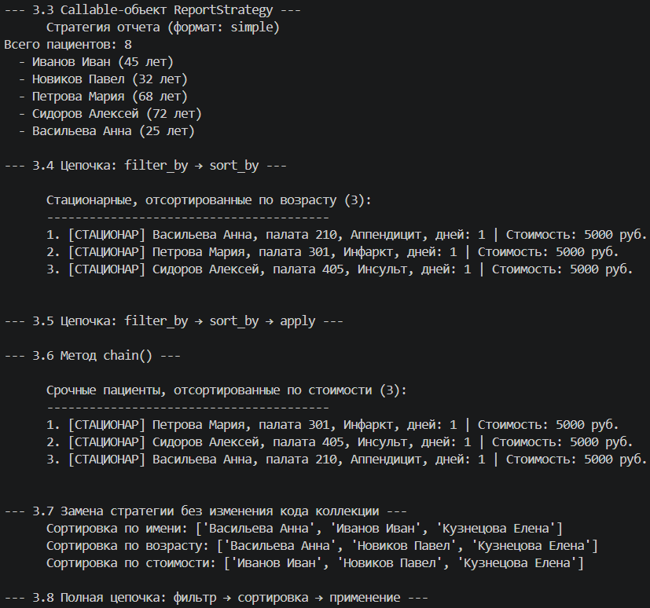
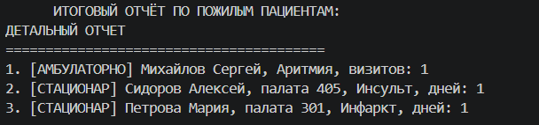

# Лабораторная работа №5
## Функции как аргументы. Стратегии и делегаты.

### Выбранная предметная область
**Медицина**

---

### Цель работы
- Освоить передачу функций как аргументов в другие функции и методы
- Научиться применять встроенные функции высшего порядка: `map`, `filter`, `sorted`
- Понять концепцию паттерна «Стратегия» и реализовать его на Python
- Освоить `lambda`-выражения и их практическое применение
- Интегрировать функциональный стиль с объектно-ориентированным кодом из предыдущих ЛР

---

### Реализованные функции и стратегии

#### Функции-стратегии для сортировки

| Стратегия | Описание | Ключ сортировки |
|-----------|----------|-----------------|
| `by_name` | Сортировка по имени пациента | `patient.name` |
| `by_age` | Сортировка по возрасту | `patient.age` |
| `by_cost` | Сортировка по стоимости лечения | `patient.get_cost()` |
| `by_type_then_name` | Сортировка по типу, затем по имени | `(patient.get_type(), patient.name)` |
| `by_diagnosis_length` | Сортировка по длине диагноза | `len(patient.diagnosis)` |

#### Функции-фильтры

| Фильтр | Описание | Условие |
|--------|----------|---------|
| `is_senior` | Пожилые пациенты | `age > 65` |
| `is_urgent` | Срочная помощь | `needs_urgent_care()` |
| `is_expensive` | Дорогое лечение | `get_cost() > 5000` |
| `is_inpatient` | Стационарные пациенты | `isinstance(patient, Inpatient)` |
| `is_outpatient` | Амбулаторные пациенты | `isinstance(patient, Outpatient)` |

#### Фабрики функций

| Фабрика | Описание | Возвращает |
|---------|----------|------------|
| `make_age_filter(min_age, max_age)` | Фильтр по возрастному диапазону | Функцию-предикат |
| `make_cost_filter(max_cost)` | Фильтр по максимальной стоимости | Функцию-предикат |
| `make_sort_by_field(field_name)` | Сортировка по любому атрибуту | Функцию-ключ |
| `make_cost_discounter(percent)` | Стратегия скидки на лечение | Функцию-обработчик |

#### Callable-объекты (паттерн Стратегия)

| Стратегия | Описание | Поведение |
|-----------|----------|-----------|
| `DiscountStrategy(percent)` | Расчет скидки на лечение | Возвращает стоимость со скидкой |
| `SortStrategy(key_func, reverse)` | Стратегия сортировки | Сортирует список объектов |
| `ReportStrategy(format_type)` | Стратегия формирования отчета | Вывод в разных форматах (simple/detailed/csv) |

---

### Расширение коллекции `PatientCollection`

| Метод | Описание |
|-------|----------|
| `sort_by(key_func, reverse=False)` | Сортировка коллекции по переданной функции-ключу |
| `filter_by(predicate)` | Фильтрация коллекции по предикату (возвращает новую коллекцию) |
| `apply(func)` | Применение функции ко всем элементам коллекции |
| `map_to(func)` | Применяет функцию и возвращает список результатов |
| `chain(filter_pred, sort_key, sort_reverse, apply_func)` | Цепочка операций: фильтр → сортировка → применение |

---

### Демонстрация работы (demo.py)

#### Сценарий 1 — Функции-стратегии для сортировки и фильтрации (оценка 3)

**Что демонстрируется:**
- Сортировка коллекции тремя разными стратегиями (по имени, возрасту, стоимости)
- Фильтрация коллекции двумя разными функциями-фильтрами
- Использование `lambda`-выражений
- Передача функций как аргументов

---

#### Сценарий 2 — Map, фабрики функций и методы коллекции (оценка 4)

**Что демонстрируется:**
- Применение `map()` для преобразования коллекции
- Фабрики функций (создание фильтров с параметрами)
- Методы `sort_by()` и `filter_by()` в коллекции
- Сравнение `lambda` и именованной функции

---

#### Сценарий 3 — Паттерн Стратегия и цепочки операций (оценка 5)

**Что демонстрируется:**
- Callable-объекты как стратегии (`DiscountStrategy`, `SortStrategy`, `ReportStrategy`)
- Цепочка операций `filter_by → sort_by → apply`
- Замена стратегии без изменения кода коллекции
- Метод `chain()` для последовательных операций

