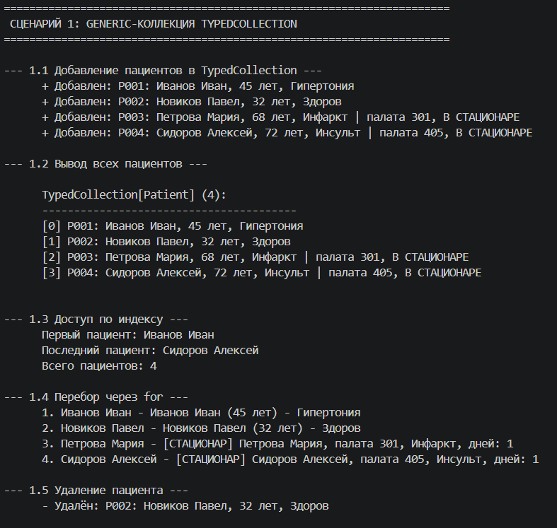
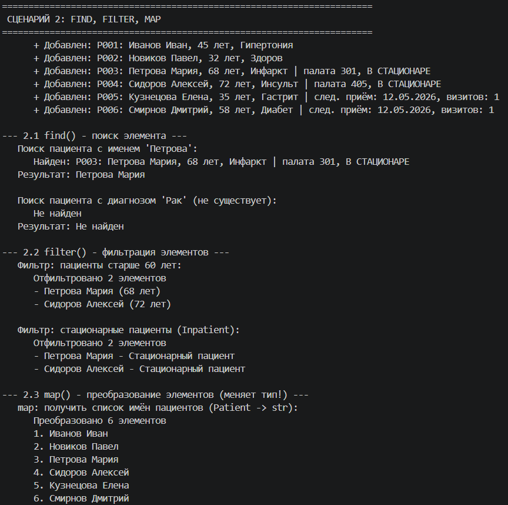
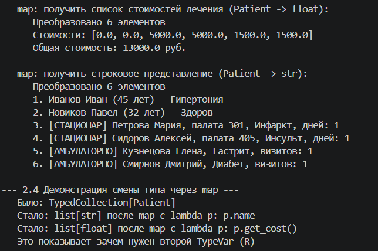
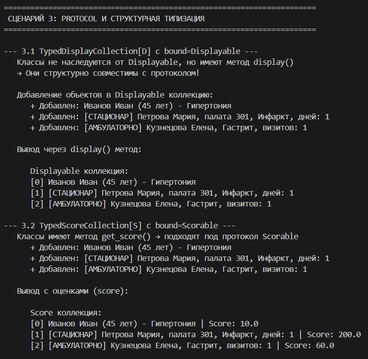
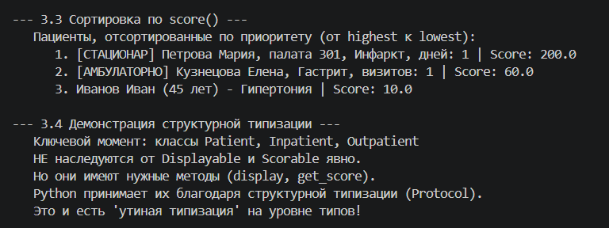

# Лабораторная работа №6
## Generics и typing (Python)

### Выбранная предметная область
**Медицина**

---

### Цель работы
- Освоить систему аннотаций типов в Python (typing)
- Научиться создавать обобщённые (generic) классы с помощью `TypeVar` и `Generic`
- Понять концепцию структурной типизации через `typing.Protocol`

---

### Реализованные типы и контейнеры

#### Аннотации типов 

Все классы из ЛР-1 и ЛР-3 дополнены аннотациями типов:

| Элемент | Пример |
|---------|--------|
| Параметры конструктора | `def __init__(self, name: str, age: int) -> None:` |
| Атрибуты класса | `self.name: str = name` |
| Возвращаемые значения | `def get_name(self) -> str:` |

### TypeVar и Generic-класс 

| TypeVar | Описание |
|---------|----------|
| `T = TypeVar('T')` | Тип элементов коллекции (любой) |
| `R = TypeVar('R')` | Тип результата преобразования для `map` |

#### Методы find, filter, map 

| Метод | Сигнатура | Описание |
|-------|-----------|----------|
| find | `find(predicate: Callable[[T], bool]) -> Optional[T]` | Находит первый элемент по условию |
| filter | `filter(predicate: Callable[[T], bool]) -> list[T]` | Возвращает все элементы по условию |
| map | `map(transform: Callable[[T], R]) -> list[R]` | Преобразует элементы в другой тип |

**Демонстрация смены типа через map:**

| Было | Преобразование | Стало |
|------|----------------|-------|
| `TypedCollection[Patient]` | `map(lambda p: p.name)` | `list[str]` (имена) |
| `TypedCollection[Patient]` | `map(lambda p: p.get_cost())` | `list[float]` (стоимости) |

---

### Протоколы Displayable и Scorable

**Protocol** — структурная типизация. Класс соответствует протоколу, если у него есть нужные методы, даже без явного наследования.

| Протокол | Требуемый метод | Описание |
|----------|-----------------|----------|
| Displayable | `display() -> str` | Объект можно отобразить |
| Scorable | `get_score() -> float` | Объект имеет оценку/приоритет |

**TypeVar с ограничениями (bound):**

| TypeVar | Ограничение | Описание |
|---------|-------------|----------|
| `D = TypeVar('D', bound=Displayable)` | Только с `display()` | Для коллекции отображаемых объектов |
| `S = TypeVar('S', bound=Scorable)` | Только с `get_score()` | Для коллекции оцениваемых объектов |

**Структурная совместимость:**

| Класс | Есть display() | Есть get_score() | Соответствует |
|-------|----------------|--------------------|----------------|
| Patient | Да | Да | Displayable, Scorable |
| Inpatient | Да | Да | Displayable, Scorable |
| Outpatient | Да | Да | Displayable, Scorable |

*Классы НЕ наследуются от протоколов, но подходят по структуре (утиная типизация).*

---

###№ Методы коллекции TypedCollection

| Категория | Методы |
|-----------|--------|
| Базовые операции | add, remove, remove_at, get_all |
| Магические методы | __len__, __iter__, __getitem__ |
| Функциональные методы | find, filter, map |
| Вывод | print_all |

---

### Демонстрация работы (demo.py)

#### Сценарий 1 — Generic-коллекция и аннотации типов (оценка 3)

**Что демонстрируется:**
- Создание типизированной коллекции `TypedCollection[Patient]`
- Добавление объектов, доступ по индексу, итерация, удаление
- Аннотации типов в действии

#### Сценарий 2 — find, filter, map (оценка 4)

**Что демонстрируется:**
- `find()` — поиск элемента по условию
- `filter()` — фильтрация коллекции
- `map()` — преобразование с изменением типа (Patient → str, Patient → float)
- Демонстрация второго TypeVar `R`

#### Сценарий 3 — Protocol и структурная типизация (оценка 5)

**Что демонстрируется:**
- Протоколы `Displayable` и `Scorable`
- TypeVar с ограничением `bound=`
- Структурная совместимость (классы не наследуются от протоколов, но подходят)
- Сортировка по `get_score()`

