# Лабораторная работа №7 — Консольное приложение

## Реализованное консольное приложение для управления пациентами

| Компонент | Файл | Назначение |
|-----------|------|-------------|
| Точка входа | `main.py` | Запуск приложения, загрузка/сохранение данных |
| CLI-интерфейс | `cli.py` | Меню, ввод пользователя, форматированный вывод |
| Бизнес-логика | `app.py` | Операции над коллекцией (CRUD, поиск, фильтрация) |
| Модели данных | `models.py` | Классы предметной области (Patient, Inpatient, Outpatient) |
| Generic-коллекция | `collection.py` | `TypedCollection` из ЛР6 (адаптирована) |
| Исключения | `exceptions.py` | Собственные исключения для ошибок предметной области |
| Хранилище | `storage.py` | JSON-сериализация/десериализация коллекции |

---

## Описание реализованных концепций

### 1. Трёхуровневая архитектура

Приложение разделено на три независимых слоя:

| Слой | Файл | Отвечает за | Не отвечает за |
|------|------|-------------|----------------|
| CLI | `cli.py` | Ввод/вывод, меню, форматирование, валидацию ввода | Бизнес-логику, работу с данными |
| App | `app.py` | Бизнес-логику, операции над коллекцией, исключения | Ввод/вывод, хранение данных |
| Models | `models.py` | Хранение данных, валидацию атрибутов | UI, бизнес-логику приложения |

**Преимущества:**
- CLI можно заменить на GUI без изменения логики
- Бизнес-логику можно тестировать независимо
- Модели можно переиспользовать в других проектах

---

### 2. Собственные исключения

Использование в бизнес-логике:

| Исключение | Назначение |
|------------|------------|
| `PatientNotFoundError` | При поиске/удалении несуществующего пациента |
| `DuplicatePatientError` | При попытке добавить пациента с существующим ID |
| `InvalidAgeError` | При некорректном возрасте (≤0 или ≥150) |
| `InvalidInputError` | При неверном формате ввода (число вместо строки и т.д.) |

---

### 3. Сохранение и загрузка данных (JSON)

- `storage.save(collection, filepath)` — сохраняет коллекцию пациентов в JSON-файл. Для каждого типа пациента (обычный, стационарный, амбулаторный) сохраняются специфические поля.
- `storage.load(filepath)` — загружает пациентов из JSON-файла. При отсутствии файла создаётся пустая коллекция. Поддерживается десериализация дочерних классов.
- При запуске приложение автоматически загружает данные; при выходе (через пункт меню "Выход" или Ctrl+C) — сохраняет.

---

### 4. Подтверждение опасных операций

Перед удалением пациента приложение запрашивает подтверждение:

Удаление происходит только после ввода `y`. При вводе `n` или любого другого символа операция отменяется.

---

### 5. Функциональные методы (из ЛР5-6)

- **Фильтрация через lambda**: `self.app.filter_seniors()`, `self.app.filter_urgent()` и т.д.
- **Сортировка по ключу**: `self.app.get_sorted_by_age()`, `self.app.get_sorted_by_cost()`
- **Поиск по условию**: `self.app.find_by_name(name)`, `self.app.find_by_id(id)`

---

### 6. Валидация пользовательского ввода

- Обработка ввода строки вместо числа (`ValueError`)
- Проверка допустимых пределов возраста (1–149)
- Проверка на пустые строки (ID, имя, диагноз)
- Проверка на дубликаты ID при добавлении
- Обработка неверных пунктов меню

---

## Демонстрация работы

### Сценарий 1 — Запуск и автозагрузка данных

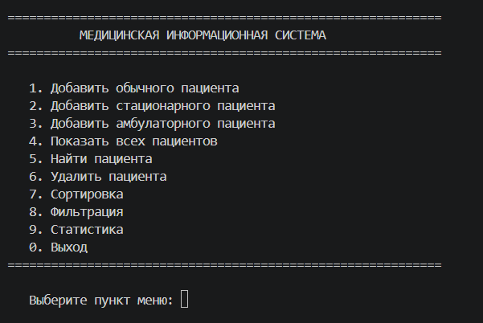

### Сценарий 2 — Добавление и удаление пациентов

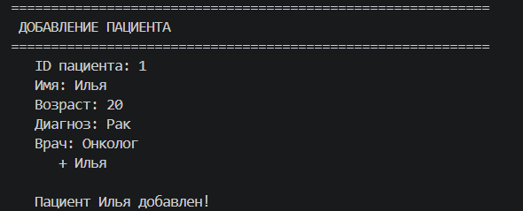
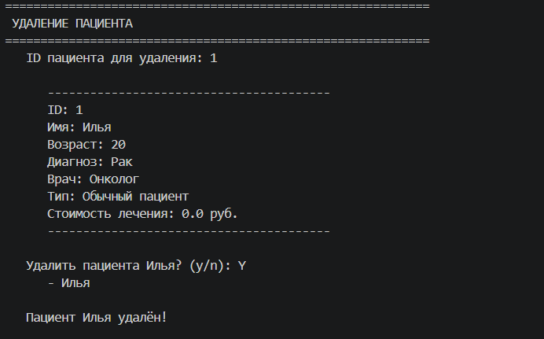

### Сценарий 3 — Сортировка и фильтрация

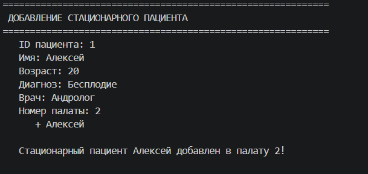
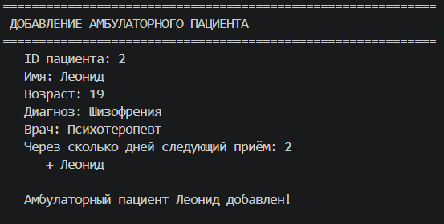
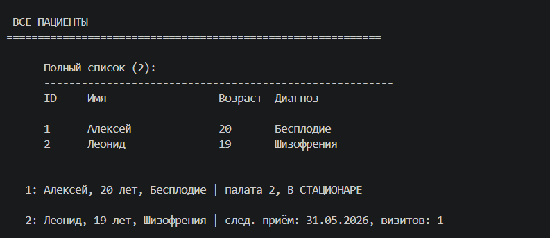
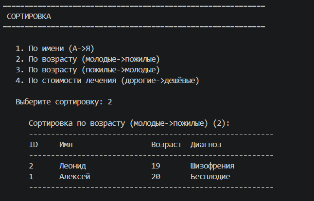
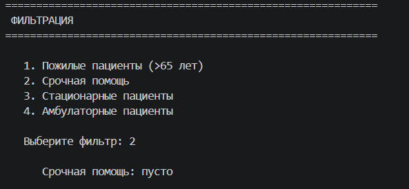
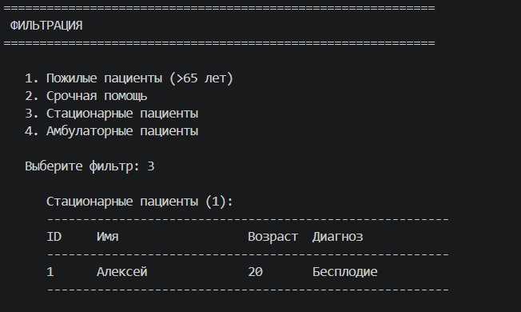
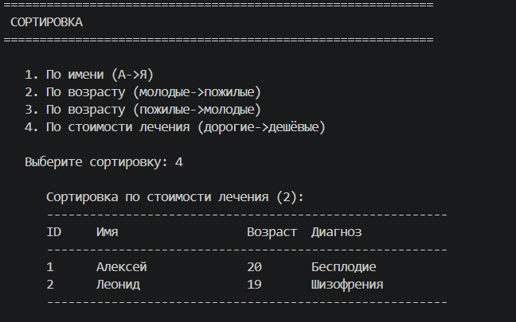

### Сценарий 4 — Обработка ошибок и исключений

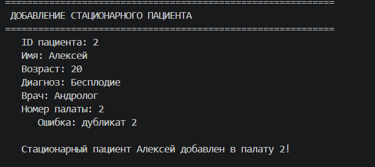
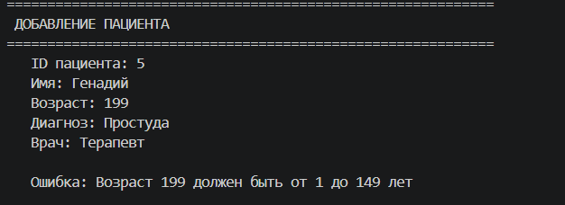
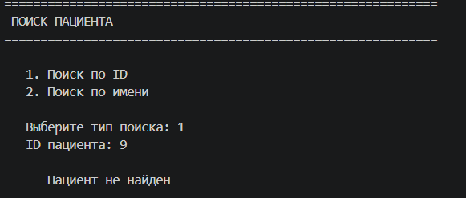
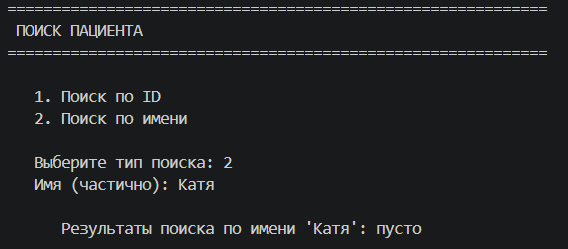

### Демонстрация работы терминала (asciinema)

---

